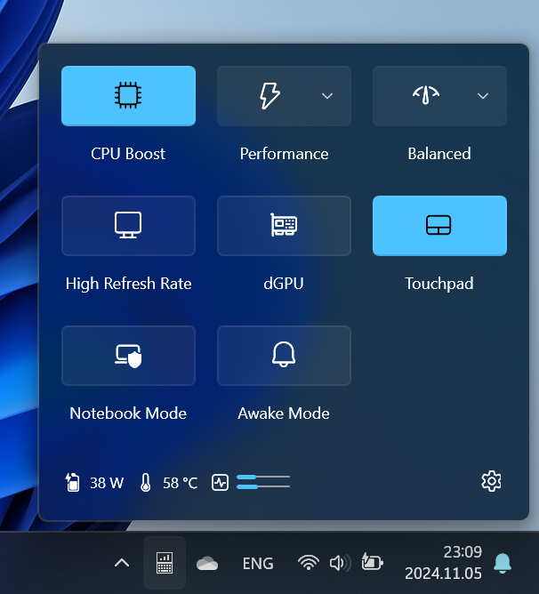

# flowOSD

[Download the latest version here](https://github.com/albertakhmetov/flowOSD/releases/download/v3.4.0/flowOSD-3.4.0.exe)

## Disclaimer

There are no warranties. Use this app at your own risk.

## About

flowOSD - is an open source application to control hardware and show OSD messages on [ASUS ROG Flow x13](https://rog.asus.com/laptops/rog-flow/2021-rog-flow-x13-series/) notebooks. 

This app is designed to provide you with a streamlined driver-only experience for your ASUS ROG Flow x13 device. Unlike other ASUS utilities, such as MyASUS and Armoury Crate, this app only requires the installation of drivers to function properly. This means that you can avoid installing unnecessary software and keep your device running smoothly and efficiently.

I created this app for my own use and would be delighted if others found it helpful too. I designed it to be a useful tool for customizing and optimizing ASUS devices without the need for extra software or utilities.

This app is tested on **GV301QH** model (120Hz WUXGA display). The proper functionality with other modifications are not guaranteed. 

Dark and light themes are supported.
